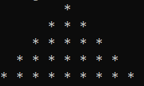
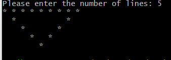

# DATA 541: Scripting and Reporting

# Assignment 1

## Objective

1. Learning the fundamental concepts of command-line commands and basic scripting
2. Understanding how to use commands in a Windows/Linux/Mac platform
3. Writing small scripts to perform common tasks

## Submission Instructions
Question 1 can be done on native Windows/Mac/Linux. However, Question 2, 3, 4 and 5 must be done in bash. For Question 1, you can submit a text file listing all the commands. Question 2, 3, 4 and 5, please submit `perfect.sh`, `pyramid.sh`, `reverse.sh` and `find.sh`, respectively.


## Question 1: Creating Directories and Files Using Commands (4 marks)

Using a terminal window on your computer, perform the following actions. List all the commands that you wrote to perform the following actions:

1. Create a new folder called `DATA541` on your desktop (0.5 mark)
2. Change the current directory to `DATA541` ( 0.5 mark)
3. Create a new folder named `Lab 1` inside `DATA541`. Note that there is a space between `Lab` and `1`(0.5 mark)
4. Create a `readme.txt` file inside `DATA541` and write the following lines: (0.5 mark)

```
Name: <your name> 
Favorite game: <Favorite Game>
Program: <Program name>
University: UBC-O
```
5. Copy the `readme.txt` into `Lab 1` (0.5 mark)
6. Navigate to `Lab 1`, sort the text of readme.txt and write the output into a new file called `sorted.txt` (0.5 mark)
7. Navigate back to the `DATA541` folder, copy the `Lab 1` folder and paste it as `Lab 2`. (Now there will be two folders inside `DATA541`) (1 mark)


## Question 2: Shell Script and Perfect Number Check (4 marks)
​
Write a shell script `perfect.sh` to find the perfect numbers between two given numbers from user input. First,
​
1. Prompts the user to enter two numbers (let’s say `num1` and `num2`). (1 mark)
​
2. Once the user enters two numbers, the program will print all the perfect numbers between the two numbers. (3 marks)
​
Note: A perfect number is a positive integer that is equal to the sum of its proper divisors, excluding itself. For example, `6` is a perfect number because its divisors are `1`, `2`, and `3`, and `1 + 2 + 3 = 6`.
​
Sample Output:
​
```
Enter the value for num1: 5
​
Enter the value for num2: 30
​
Perfect numbers between 5 and 30 are:
​
6
28
```
​


## Question 3: Shell Script and Pattern (4 marks)

First, create a  shell script called `pyramid.sh` with the following code:

```
#Shell Script to create pyramid using *
rows=5          #Number of lines of stars
for((i=1; i<=rows; i++))      #for loop for creating lines
do
  for((j=1; j<=rows - i; j++))  #for loop for creating spaces
  do
    echo -n "  "      #-n message to tell echo not to append a newline
  done
  for((j=1; j<=2*i - 1; j++))    # for loop for drawing stars
  do
    echo -n "* "        
  done
  echo
done
```

Once you run the program, it should show the following output:




Now change the program so that it:
​
1. Prompts a user to give the number of lines (N) that the program should display with stars (1 mark)

​2. The given program prints a pyramid that starts with 1 star and N starts at the last row. Flip the pyramid that is have N stars at the first row and 1 start at the last row. (1.5 marks)
​
3. modify the code to show only the outer surface of the pyramid filled with stars (1.5 marks).
​
Output:
​


## Question 4: Shell scripts and reverse number (3 marks):
Write a shell script name `reverse.sh` that takes a number n (assume n>10), return the number in reverse. Do not use any existing commands to reserve the number.
Output:
```
Please enter a number: 123654
456321
```

## Question 5: Shell scripts to find information (5 marks): 

Write a shell script name `find.sh` that :

1. Takes two inputs from users as command-line arguments: a file name and a string. If a user doesn’t provide the correct number of arguments, then show a message to provide the correct input (2 marks)
2. Shows a message (e.g., "File not found") if the file doesn’t exist in the given directory  (1 mark)
3. If the arguments are correct, then read the file. Find the lines that contain the string and write the number of occurrences of the string (2 marks)

Output:
```
$ ./find.sh country.txt
Please privide the correct number of arguments
$ ./find.sh country.txt Ca
Cambodia
Cameroon
Canada
Cape Verde
4
```
