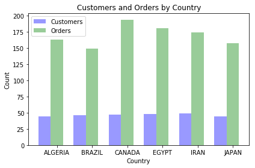

# DATA 540: Databases and Data Retrieval
# Lab 3: Database Programming

## Objectives

1. Query a MySQL database using Python and R.
2. Use SQLite with R as an embedded database.
3. Perform analysis with data extracted from a relational database.

**[Details on how to connect to MySQL](../lab1/usemysql.md)**

The database is [TPC-H](http://www.tpc.org/tpch/) which is a standard database used to benchmark database systems. It is designed to be a data warehouse of information on customers, orders, and products. The database is available as **tpch** on the MySQL server.  Submit your Python and R programs to GitHub.

### Question 1 (10 marks)

Create a **Python** program that queries the TPCH database to perform some analysis. Details:

  * Create a successful connection to the **tpch** MySQL database on **cosc304.ok.ubc.ca**. Handle any errors with try-except. (1 mark)
  * Write and execute an SQL query that retrieves for each nation name the number of unique customers and orders from that nation in the year **2018**. Only show nations where the number of customers is greater than **43**. (3 marks)
  * Retrieve the data from the database cursor and put it in lists so that it will be ready for graphing. (1 mark)
  * Create a bar graph (see [DATA 531 Lecture 5](https://github.com/ubco-mds-2022/Data-531/blob/main/Lectures/Lecture5.ipynb)) that visualizes the information. (2 marks)
  * For the second query, read an integer customer id from the user and use that input in a query that returns the top 5 products (by **l_quantity**) ordered by that customer. Only consider orders where order status is **'O'** and the customer account balance is less than **$1000**. Retrieve only the top 5 products. (2 marks)
  * Print out the **top 5** products for that customer. (1 mark)
  
**Output:**



```
Enter a customer id: 788
Top 5 products for customer: 788
PartKey	Total Quantity
1835 	 124.00
508 	 91.00
1264 	 49.00
1727 	 49.00
1195 	 47.00
```

### Question 2 (10 marks)

Create a **R** program that queries the TPCH database to perform some analysis. Our company has a terrible inventory management problem that we need to solve. Some parts have way too much inventory, while others do not have enough.  Remember a part is supplied by a particular supplier, and the **partsupp** table stores this information with **ps_availqty** as the current inventory. Details:

  * Create a successful connection to the **tpch** MySQL database on **cosc304.ok.ubc.ca**. (1 mark)
  * Write and execute an SQL query that computes a summary table that contains the columns **ps_partkey**, **ps_suppkey**, **year** (use YEAR() function on **l_shipdate**), and sum of lineitem quantities (**l_quantity**) (rename as **shippedQuantity**). Sort by **ps_partkey**, **ps_suppkey**, and **year** ascending. Print out the first 10 rows. (2 marks)
  * Create a connection to a local SQLite database. (1 mark)
  * Write the MySQL query result as a table to the SQLite database. (1 mark)
  * Write a SQLite query to return the parts list where there is not enough inventory based on 2018 sales. Ignore any parts if they do not have a 2018 sales amount. Print the first 5 rows. (1 mark)
  * For **ps_partkey=217** and **ps_suppkey=18**, use the 5 years of sales data and linear regression (see [DATA 531 Lecture 7](https://github.com/ubco-mds-2022/Data-531/blob/main/Lectures/Lecture7/Lecture7.ipynb) to predict sales for **2019**. (2 marks)
  * Print the top 10 worst products that have too much inventory on a percentage basis compared to **2018** sales. Only consider products that have been a **shippedQuantity** of at least **6**. (1 mark)
  * Connections to MySQL and SQLite must be closed. (1 mark)
  
**Output:**

```
   ps_partkey ps_suppkey ps_availqty year shippedQuantity
1           1          2        3325 2015              50
2           1          2        3325 2018               5
3           1         27        8076 2013              62
4           1         27        8076 2015              43
5           1         27        8076 2016              34
6           1         27        8076 2018             134
7           1         52        3956 2015               4
8           1         52        3956 2017              40
9           1         52        3956 2018              49
10          1         77        4069 2013              76

Products with insufficient inventory based on 2018 sales:
  ps_partkey ps_suppkey ps_availqty year shippedQuantity
1         50         76          43 2018              67
2         51          2         138 2018             189
3         81         57          58 2018              68
4        217         18          20 2018              92
5        281         63          51 2018             114

Estimated sales for 2019:
94.4 

Top 10 parts with too much inventory:
   ps_partkey ps_suppkey ps_availqty year shippedQuantity percentageOverstocked
1        1828         58        9958 2018               6              1659.667
2         200         53        9408 2018               6              1568.000
3         287         15        9210 2018               6              1535.000
4        1695         19        9154 2018               6              1525.667
5        1388         65        8718 2018               6              1453.000
6         631         32        8673 2018               6              1445.500
7        1457         75        8526 2018               6              1421.000
8        1891         78        9897 2018               7              1413.857
9        1523         24        8461 2018               6              1410.167
10        834         68        9559 2018               7              1365.571
```
