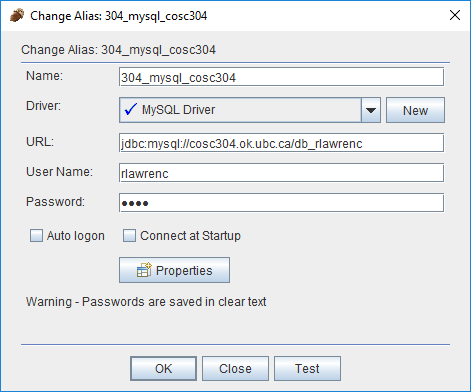

# DATA 540: Databases and Data Retrieval
# Using MySQL

## Overview

One of the databases we will be using is MySQL. MySQL is an open source database available at [www.mysql.com](https://www.mysql.com). You can install it on Windows or Linux machines.

MySQL has been installed on the Linux machine **cosc304.ok.ubc.ca**.


## Connecting Off-Campus

If you are off campus, you MUST connect using [VPN to UBC Okanagan](https://it.ubc.ca/services/email-voice-internet/myvpn/setup-documents) (use: myvpn.ok.ubc.ca) to be able to access the databases. If you are on campus, you must be connected to **UBCSecure** wifi.


## Connecting via SSH and Command Line

Use SSH or PuTTY to connect to **cosc304.ok.ubc.ca**.

Login to the **cosc304.ok.ubc.ca** server using your UBC CWL credentials.

MySQL has a command line interface that can be started by typing the command: ``mysql -u <userid> -p``. The ``-p`` indicates that a password is required. Your MySQL user id is the first letter in your first name followed by up to 7 letters of your last name and your initial password is your student id.

### Changing Password (optional)

To change your MySQL password, connect using the command: 

```mysql -u <userid> -p```

and run the command: 

```set password = password('newpassword');```

Then exit MySQL and connect again using the command: 

```mysql -h cosc304.ok.ubc.ca -u <userid> -p```

and run the command: 

```set password = password('newpassword');```

The reason for the two connections and password changes is that a user in MySQL is uniquely identified by a user name and host combination. localhost and cosc304.ok.ubc.ca are two different hosts, so the password must be changed twice.

### Common Commands

Here are some common commands for selecting and using databases. Note that all commands are terminated with a semi-colon (;).

| Function	| Command |
|---------------|---------|
| Listing all databases	|	show databases;	|
| Use a database		| use dbname; |
| List all tables in a database	| show tables; |

Initially, you have access to your own database which has the name "db_" (example: db_rlawrenc). You have full-control of your own database which includes the ability to create tables. Note that you do not have grant privileges on your database (to prevent sharing). You also have SELECT access to other sample databases including **WorksOn**.


### Running a Command Script

There are several ways to run a script in MySQL. We will assume a script file called ``myscript.sql``.

 - **Using copy and paste** - the simplest way is to copy all text in the ``myscript.sql`` file and paste it into the window containing the MySQL prompt. Note that you should be logged on to MySQL before pasting the text.
 - **Using source command** - if you are in MySQL (at a prompt), you can run the command ``source myscript.sql`` to run the commands in the file.
 - **Using commandline** - MySQL has command line options for running scripts. To run a script with verbose (nicely formatted) output, run the command: ``mysql -p -t -vvv < myscript.sql`` Note that you are still prompted for your password and are running the command from a Linux prompt (not a MySQL prompt).
	
### Importing Data

There are two ways to import data into MySQL. First, you can create a program to read the data file and produce a script containing INSERT commands to the database. Then you run the script. The other choice is to use the import facilities in the database. For MySQL, the command is called LOAD. The following command will import a comma-separated file (produced on a Windows machine) into a MySQL table:

```
Syntax:
load data local infile 'filename' into table tablename fields terminated by ',' LINES TERMINATED BY '\r\n';

Example:
load data local infile 'course.txt' into table course fields terminated by ',' LINES TERMINATED BY '\r\n' ;
```

Note that if you are loading a file saved on a Linux machine, drop the LINES TERMINATED BY clause.


## Connecting via SQuirreL GUI

[SQuirreL](http://squirrel-sql.sourceforge.net/) is an open source graphical query tool. SQuirreL is capable of querying any JDBC-accessible database including Oracle, MySQL, and SQL Server.

After installing SQuirreL, download the [MySQL JDBC driver](mysql-connector-java-5.1.44-bin.jar) and put it in the **lib** folder for SQuirreL. If the driver is successfully installed, you will see a green check mark in the **Drivers** tab by the **MySQL driver**.

Start up SQuirreL. Register our MySQL server with the information:
```
Name: MySQL
Login name: (your MySQL user id - the first letter of your first name followed by up to 7 letters of your last name)
Password: (initially your student #)
Host name: cosc304.ok.ubc.ca
Port: (leave blank for default)
Database: db_(your MySQL user id - the first letter of your first name followed by up to 7 letters of your last name)
```


## Connecting via MySQL Workbench

[MySQL Workbench](https://www.mysql.com/products/workbench/) is a visual database design tool that integrates SQL development, administration, database design, creation and maintenance into a single development environment for the MySQL database system.

To connect using MySQL workbench, as shown below, give your connection a name (Connection Name), the **Hostname** is the server name **cosc304.ok.ubc.ca**. The **Username** is your MySQL userid (Your MySQL user id is the first letter in your first name followed by up to 7 letters of your last name). Click ok, double click on the connection and it should ask for your MySQL password. Your password is your student id.

