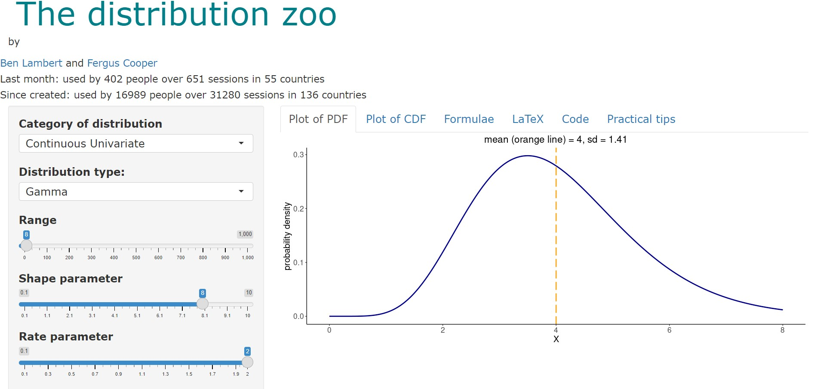

```{r setup, include=FALSE}
knitr::opts_chunk$set(echo = TRUE)

library(ggplot2)
library(bayesrules) 
```

## Question 1

$Y \sim pois(\lambda), \ \lambda \in (0,\infty)$     
      
$\text{Given PMF of Poisson = } P(Y = k) = \frac{e^{-\lambda} \lambda^k}{k!}$    
       
$=> \text{Likelihood of } P(Y|\theta) = L(\theta) \propto \lambda^Y e^{- \lambda}$    

## Question 2

$\text{Given } f(x|\alpha,\beta)=\frac{\beta^\alpha \lambda^{\alpha-1}e^{-\beta\lambda}}{\Gamma(\alpha)}$   
      
$=> Prior = P(\lambda|\alpha,\beta) \propto \lambda^{\alpha-1}e^{-\beta\lambda}$     

## Question 3   

$Posterior \propto Prior*Likelihood$     
     
$= \lambda^{\alpha-1}e^{-\beta\lambda} \lambda^Y e^{- \lambda}$  
    
$= \lambda^{Y + \alpha-1}e^{-(1+\beta)\lambda}$     
    
$let \ Y + \alpha=\tilde{\alpha} \text{ and } 1+\beta=\tilde{\beta}$    
    
$=> Posterior = \lambda^{\tilde{\alpha}-1}e^{-\tilde{\beta}\lambda}$    
    
    
From the above, it can be seen the posterior has the same functional form as the prior, ie. a Gamma, showing the Gamma prior is a conjugate to the Poisson likelihood.  

## Question 4   

$\lambda \in(0,8)$   
    
Try and find Gamma which is close to normal on the range of 0 to 8 because assuming some sort of normal probability distribution of lambda between 0 and 8 so as value gets closer to 0 or 8, it becomes smaller and smaller to avoid exceeding the range.    
     
Choose: $\alpha=8, \ \beta=2$     

{ width=1000px height=500px }   
    
## Question 5

$Likelihood = L(\theta) \propto \prod \lambda^{Y_{i}} e^{- \lambda} = \lambda^2e^{-\lambda}*\lambda^0e^{-\lambda}*...*\lambda^4e^{-\lambda} = \lambda^{18}e^{-7\lambda}$    
     
$\alpha=8, \ \beta=2$     
     
$=> Posterior \propto \lambda^{8-1}e^{-2\lambda}\lambda^{18}e^{-7\lambda}=\lambda^{26-1}e^{-9\lambda}$   
     
$=> Posterior \sim Gamma(\alpha=26, \ \beta=9)$   

## Question 6
```{r}

plot_gamma_poisson(
  shape = 8,
  rate = 2,
  sum_y = 18,
  n = 7,
  prior = TRUE,
  likelihood = TRUE,
  posterior = TRUE
)

```   
    
## Question 7   
    
Based on the tri-plot above, the posterior is closer to the likelihood indicating there was sufficient data to overcome our prior beliefs (ie. the likelihood had MORE strength than the prior).    

## Question 8

```{r}

result <- summarize_gamma_poisson(shape = 8, rate = 2, sum_y = 18, n = 7)
print(result)

```   

Then, based on the above table, the resulting posterior would have a typical daily rate of spam emails of approx. `r round(result$mean[2],0)` emails.    

## Question 9  
### Part I     

$Posterior \ a = k+a = 54+1 = 55$    
   
$Posterior \ b = n+b-k = 100+5-54 = 51$   
    
$Posterior \sim Beta(a=55, \ b=51)$

### Part II

$Var(Prior) = \frac{\alpha\beta}{(\alpha+\beta)^2(\alpha+\beta+1)} = \frac{1*5}{(1+5)^2(1+5+1)}= `r 5/(36*7)`$    

### Part III

$Var(Posterior) = \frac{\alpha\beta}{(\alpha+\beta)^2(\alpha+\beta+1)} = \frac{55*51}{(55+51)^2(55+51+1)}= `r (55*51)/((55+51)^2*(55+51+1))`$    

### Part IV
```{r}

plot_beta_binomial(alpha = 1, 
                   beta = 5, 
                   y = 54, 
                   n = 100,
                   prior = TRUE,
                   likelihood = TRUE,
                   posterior = TRUE)

```   

### Part V   

```{r}

result <- summarize_beta_binomial(alpha = 1, beta = 5, y = 54, n = 100)
print(result)

```     

**Posterior Mode = `r result$mode[2]`**    
  
## Question 10    

### Part I     

$Posterior \ a = k+a = 1+1 = 2$    
   
$Posterior \ b = n+b-k = 1+5-1 = 5$   
    
$Posterior \sim Beta(a=2, \ b=5)$

### Part II

$Var(Prior) = \frac{\alpha\beta}{(\alpha+\beta)^2(\alpha+\beta+1)} = \frac{1*5}{(1+5)^2(1+5+1)}= `r 5/(36*7)`$    

### Part III

$Var(Posterior) = \frac{\alpha\beta}{(\alpha+\beta)^2(\alpha+\beta+1)}= \frac{2*5}{(2+5)^2(2+5+1)} = `r 10/((2+5)^2*(2+5+1))`$    

### Part IV
```{r}

plot_beta_binomial(alpha = 1, 
                   beta = 5, 
                   y = 1, 
                   n = 1,
                   prior = TRUE,
                   likelihood = TRUE,
                   posterior = TRUE
                   )

```   

### Part V
```{r}

result <- summarize_beta_binomial(alpha = 1, beta = 5, y = 1, n = 1)
print(result)

```     

**Posterior Mode = `r result$mode[2]`** 

## Question 11
### 1.   

Comparing the variance in scenario 1 of the prior vs. posterior, the variance decreased from about 0.02 of the prior to 0.025 of the posterior distribution.    
    
### 2.  

Comparing the variance in scenario 2 of the prior vs. posterior, the variance increased from about 0.02 of the prior to 0.002 of the posterior.    
     
## Question 12
### 1.    

Comparing the strength of the prior and likelihood, based on the tri-plot and sample size of 100 in scenario 1, we can see the posterior was pulled closer to the likelihood, indicating the prior was weaker than the likelihood and the sample size of 100 was enough to overcome our prior beliefs.    

### 2. 

Comparing the strength of the prior and likelihood, based on the tri-plot and sample size of 1 in scenario 2, we can see the posterior was pulled closer to the prior, indicating the prior was stronger than the likelihood and the sample size was not large enough to overcome our prior beliefs.  


