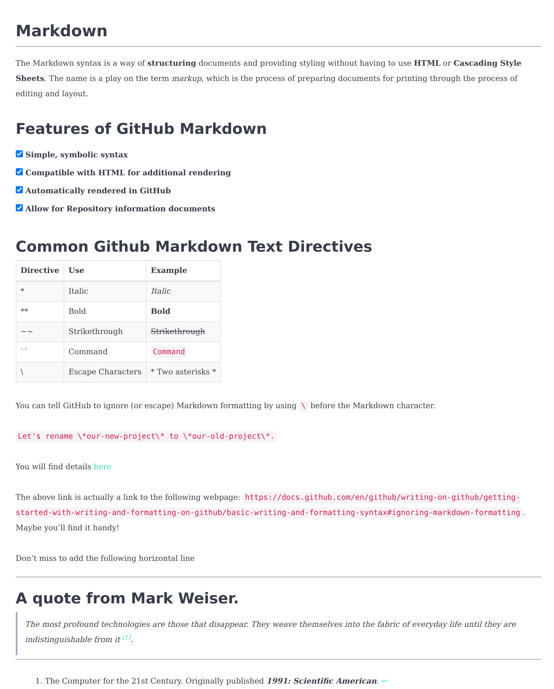
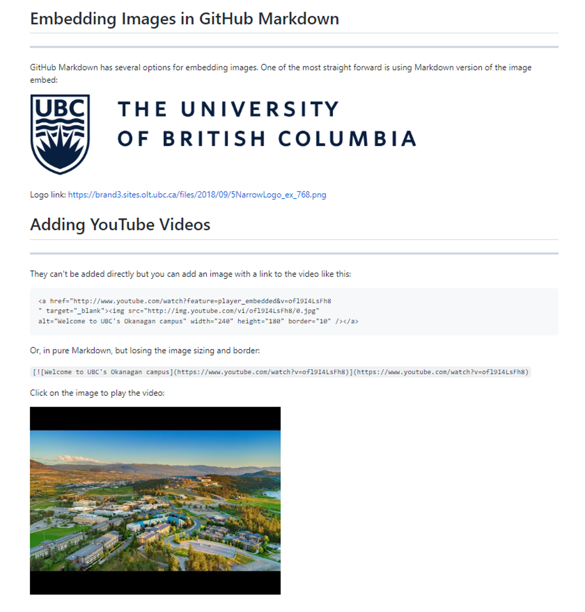
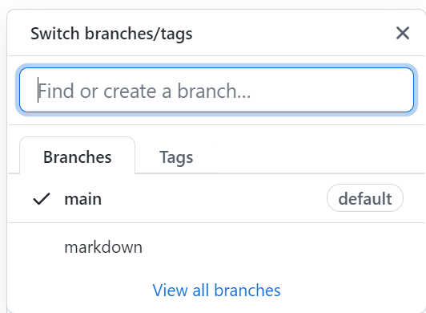

# DATA 541: Version Control and Markdown

# Assignment 3

## Objective

1. Become familiar with Markdown Syntax
2. Understand the Process of Git Version Control
3. Learning how to create and merge branches in Git


## Part 1: Markdown Syntax (10 marks)

**Question 1 (6 marks)**: Using the Markdown syntax discussed in the class, duplicate the example below in Markdown. Please use https://dillinger.io/ for question 1 and 2. Name this file *lab3_q1.md*. 

<kbd></kbd>

You can refer back to the lecture notes on Markdown, as well as [GitHub's introduction to Markdown](https://help.github.com/articles/basic-writing-and-formatting-syntax/).

**Question 2 (4 marks)**: Write a second Markdown file using image embedding. For this question, try to duplicate the example below. The image used in the example can be found [here](https://brand3.sites.olt.ubc.ca/files/2018/09/5NarrowLogo_ex_768.png). Name this file *lab3_q2.md*.

<kbd></kbd>


## Part 2: GitHub Version Control (10 marks)


**Question 1 (6 marks)**: Often, it makes sense to create a branch of a repository to work on that is separate from the original codebase. Write the commands into a text file or take screenshots as you perform the following actions to create a Git branch:
1. Clone your Lab 3 repository to your local machine (1 mark)
2. Navigate into the cloned repository folder
3. Create a new Git branch called **Markdown** (1 mark)
4. Use checkout to move to the **Markdown** branch. You may use the ```-b``` flag to create and checkout a branch at the same time. (1 mark)
5. Check the status of the current repository and confirm you are on the **Markdown** branch (1 mark)
6. Add and commit your lab3_q1.md and lab3_q2.md files to the current branch. (1 mark)
7. Use the push command with the following flags ```-u origin Markdown``` to push the **Markdown** branch to GitHub. (1 mark)
8. On GitHub, you should see the **Markdown** branch in the Branch dropdown:




**Question 2 (4 marks)**: Once the desired work has been completed on a branch, you can then merge that branch into the **master** branch. Write the commands into the same text file as before, or take screenshots as you perform the following Git merge:
1. Use checkout to move back to the master branch of your Git repository. (1 mark)
2. Merge your **Markdown** branch into your **master** branch. The syntax for the merge command is ```git merge branchName```. (1 mark)
3. Perform a push to push the merge up to GitHub.
4. Delete your **Markdown** branch - now that it is merged, it is no longer necessary. (1 mark)
5. Use the git log function to print a short log of your actions. If the ```-oneline``` flag doesn't work, try using ```--pretty=oneline``` instead. Take a screenshot of the output. (1 mark)
6. Add and commit your text files with your commands and/or screenshot(s) to the **master** branch of your lab repo and push. Your lab repo **master** branch should now contain your Markdown files from Part 1 of this lab, plus your text files and screenshots from Part 2. Submit the link to your repo on Canvas.