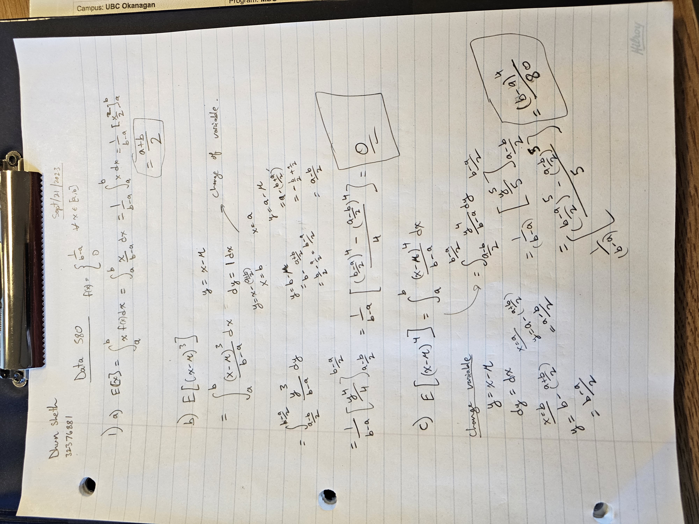

```{r setup, include=FALSE}
knitr::opts_chunk$set(echo = TRUE)
```

## Question 1


```{r question_1a}



```


## Question 2
### Part A

``` {r question_2_a}

x <- runif(100000, min=0, max=1)

m <- mean(x)
print(m)

```

Computed mean of x is `r m` \
Theoretical mean is (a+b)/2 = (0+1)/2 = 0.5


### Part B

``` {r question_2_b}

k <- mean( (x-mean(x))**3 )

print(k)

```

Computed value of skewness is `r k` \
Theoretical skewness of uniform distribution is 0.


## Question 3
### Part A

```{r question_3a}

binsim<- rbinom(10000,20,0.3)

prob_less_than_or_equal_to_5 <- sum(binsim <= 5)/10000
print(prob_less_than_or_equal_to_5)
```

Simulated P(X <= 5) = `r prob_less_than_or_equal_to_5`


### Part B

```{r question_3b}

prob_equal_5 <- sum(binsim == 5)/10000
print(prob_equal_5)
```

Simulated P(X = 5) = `r prob_equal_5`


### Part C

```{r question_3c}

mean_binsim <- mean(binsim)
print(mean_binsim)
```

Simulated mean of binsim is `r mean_binsim`


### Part D

```{r question_3d}

var_binsim <- var(binsim)
print(var_binsim)
```

Simulated var of binsim is `r var_binsim`

## Question 4
```{r question_4}

pois<- rpois(10000,7.2)

m_pois<-mean(pois)
var_pois<-var(pois)
print(m_pois)
print(var_pois)
```

Simulated mean of Poisson is `r m_pois` and variance is `r var_pois` \
Theoretical mean and variance is 7.2.

## Question 5
### Part A
```{r question_5a}

p1<- rpois(10000,5)
p2<- rpois(10000,25)
p3<- rpois(10000,125)
p4<- rpois(10000,625)

p1_mean<- mean(p1)
p2_mean<- mean(p2)
p3_mean<- mean(p3)
p4_mean<- mean(p4)

print(p1_mean)
print(p2_mean)
print(p3_mean)
print(p4_mean)

```

### Part B
```{r question_5b}


p1_log_mean<- mean(log(1+p1))
p2_log_mean<- mean(log(1+p2))
p3_log_mean<- mean(log(1+p3))
p4_log_mean<- mean(log(1+p4))

print(p1_log_mean)
print(p2_log_mean)
print(p3_log_mean)
print(p4_log_mean)

```

### Part C
```{r question_5c}


p1_root_mean<- mean(sqrt(p1))
p2_root_mean<- mean(sqrt(p2))
p3_root_mean<- mean(sqrt(p3))
p4_root_mean<- mean(sqrt(p4))

print(p1_root_mean)
print(p2_root_mean)
print(p3_root_mean)
print(p4_root_mean)

```


## Question 6
```{r question_6, include=FALSE}

runifAvg <- function(N, n) {
X <- matrix(runif(N*n),N,n)
rowMeans(X)
}

hist(runifAvg(10000,3))
hist(runifAvg(10000,6))
hist(runifAvg(10000,10))
hist(runifAvg(10000,15))
hist(runifAvg(10000,30))
hist(runifAvg(10000,100))

```


## Question 7
```{r question_7, include=FALSE}

runifAvg <- function(N, n) {
X <- matrix(rbinom(N*n, 1, 0.25),N,n)
rowMeans(X)
}

hist(runifAvg(10000,3))
hist(runifAvg(10000,6))
hist(runifAvg(10000,10))
hist(runifAvg(10000,15))
hist(runifAvg(10000,30))
hist(runifAvg(10000,100))

```

## Question 8
```{r question_8, include=FALSE}
rate <- 1.5
time <- 100000

N <- rpois(1, lambda = rate*time)
U <- runif(N, max = time)

PoissonPoints = sort(U)

```


## Question 9
```{r question_9, include=FALSE}

interval <- cut(PoissonPoints,c(0:time))
table(interval)
mean(table(interval))


```


